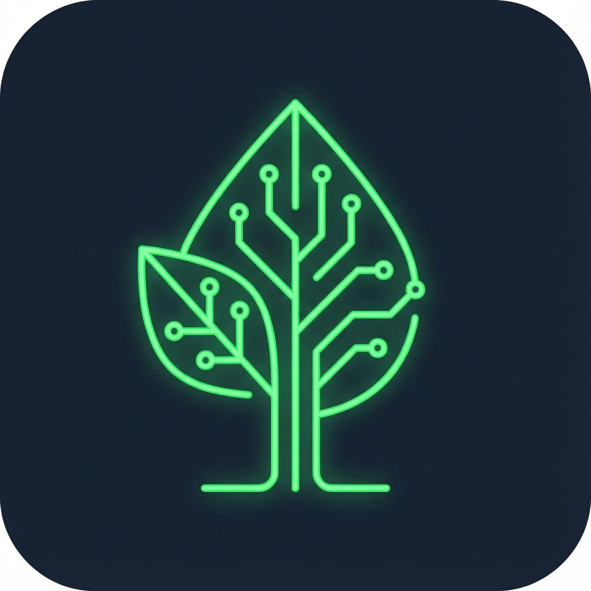

# 🌳 Territoire Vivant

Application de "Nature Augmentée" transformant l'exploration locale en jeu écologique interactif.
Conçu pour reconnecter les citoyens à leur environnement via des interactions numériques ludiques.



## ✨ Fonctionnalités

### 🧭 Exploration & Carte
- **Carte Interactive** : Visualisation des lieux (Eau, Arbre, Jardin) sur une grille animée.
- **Scanner QR** : Interface "Laser" pour scanner les codes sur place.
- **Géolocalisation** : (Simulée) Détection de la proximité des spots.

### 🎮 Gamification
- **Missions** : Accomplissez des actions (ex: "Arroser le chêne") pour gagner de l'XP.
- **Profil Gardien** : Suivi de niveau, barre de progression et collection de badges.
- **Confettis** : Célébration visuelle à chaque succès !

### 🧞‍♂️ Immersion
- **Spirit Chat** : Discutez avec l'esprit du lieu (IA simulateur) pour en apprendre plus sur l'histoire et l'écologie locale.
- **Design Audio** : Ambiance sonore immersive (bips futuristes, sons naturels).
- **Design Premium** : Interface "Glassmorphism" avec accents néons.

### 🛠️ Administration
- **Dashboard Créateur** : Interface simple pour ajouter de nouveaux lieux sans coder.

## 🚀 Stack Technique

- **Framework** : [Next.js 16](https://nextjs.org/) (App Router)
- **Langage** : TypeScript
- **Style** : [Tailwind CSS v4](https://tailwindcss.com/)
- **Animations** : [Framer Motion](https://www.framer.com/motion/)
- **Icônes** : Lucide React
- **PWA** : Support Mobile (Manifest & Icons)

## 🛠️ Installation & Démarrage

1.  **Cloner le projet**
    ```bash
    git clone https://github.com/votre-repo/territoire-vivant.git
    cd territoire-vivant
    ```

2.  **Installer les dépendances**
    ```bash
    npm install
    ```

3.  **Lancer le serveur de développement**
    ```bash
    npm run dev
    ```
    Ouvrez [http://localhost:3000](http://localhost:3000) pour voir l'application.

## 📦 Déploiement

Le projet est optimisé pour être déployé sur **Vercel**.

1.  Poussez votre code sur GitHub/GitLab.
2.  Importez le projet dans Vercel.
3.  Le déploiement est automatique !

Aucune configuration complexe n'est requise.

---

*Développé avec 💚 pour la nature.*
